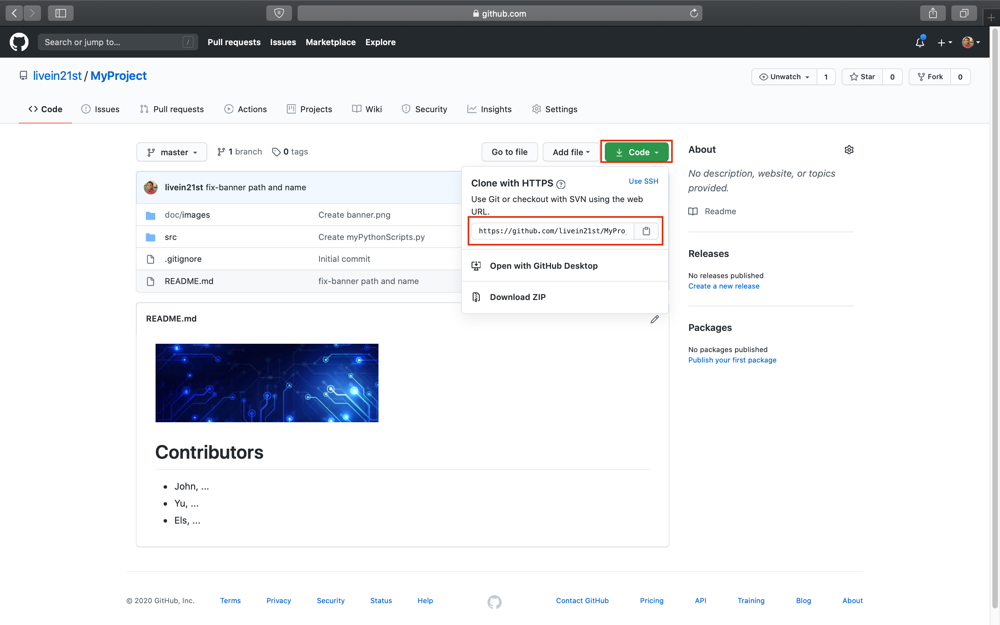
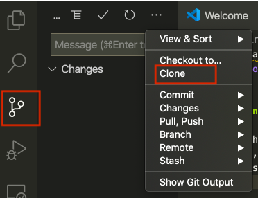
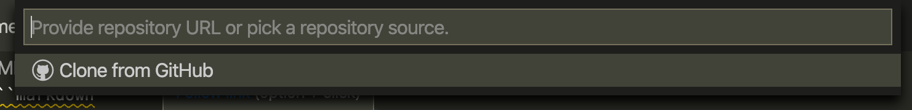
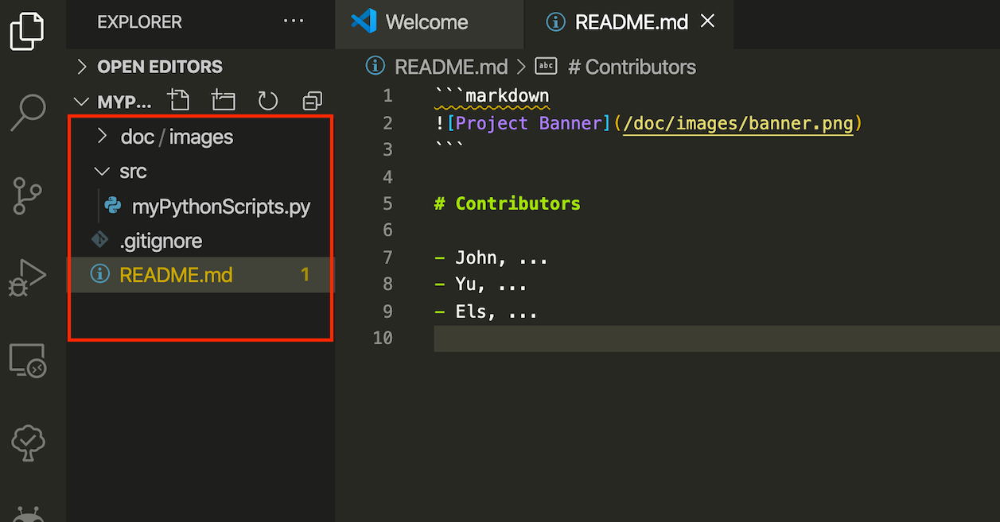
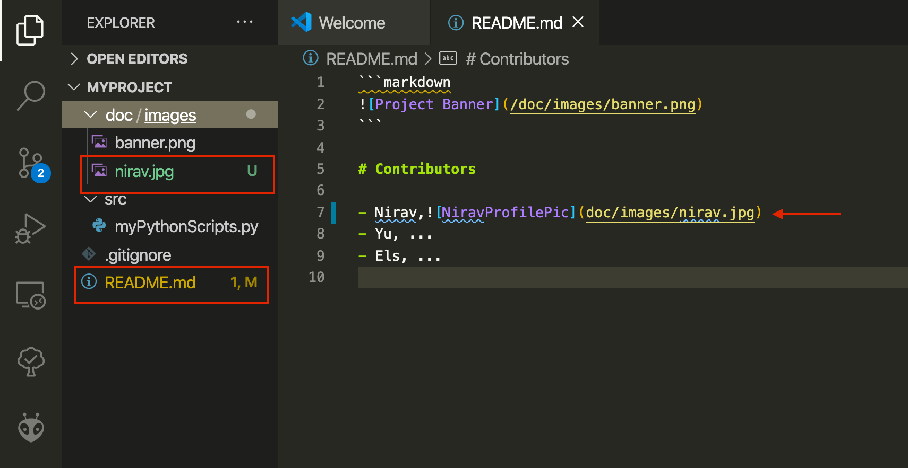
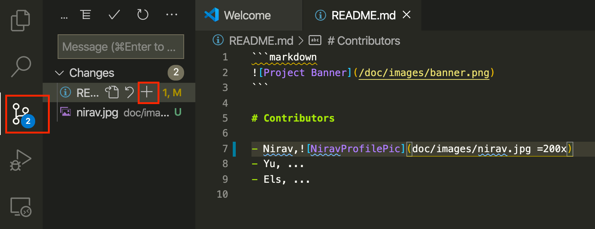
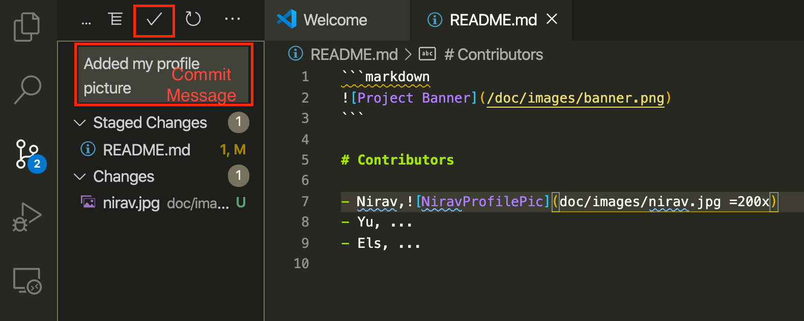

---

- Do not remove this line (it will not be displayed)
  {:toc}

---

In the previous module we setup a prototyping environment and we explored the behaviour of a default Python mudules (kasa) running on the Raspberry Pi. It is time to start coding and define ourself this behaviour.

# Step 1: Git Flow

You got acquainted to

## Task 1.1: Getting the Shared Repository on your Machine

To get your shared repository on your machine, we use 'git clone' with the URL to your repository. You can find this URL on the GitHub page of your repository. Click on the green drop down button 'Code' and copy the URL.



In VS Code you can click on the Source Control button (3rd icon in the left panel) and 'clone repository'.



In the text field that open at the top, paste the URL of your repository and press ENTER.



You now have a copy of your team repository on your machine. In the left panel you will recognise the tree of files and directories, including the doc,src and README.md.



## Task 1.2 Edit your files

As we were editing the file `README.md` on GitHub in the previous module, we can do the same here on our machine.

Each team member can, on its own machine, drag and drop a picture of her/himself in the directory `doc/images`. You note that this file is shown in a green font: it is a new file to track.

Then, open the README.md and edit the Contributor section to show the profile picture. We use again the Markdown image command, adding a maximum width 200 pixels (we don't want the pic to appear unreasonably big).

```bash

```

The README.md file appears now in a yellow font: it has been modified.



## Task 1.3 Stage and Commit Changes

We can now prepare our files for a new version. We select the changes we want in this new version. This is called 'staging'. Click on the `+` icon next to each file in github source control button on.



After staging the changes, we will add small description about the changes and create a new version of the git repository by pressing 'right tick mark'. This step is call `Committing`. We are commiting our changes in a local repository (in your own machine only) and create a snapshot of the entire project directory (locally) with new changes. Later we can move back and revert the changes we want.



## Task 1.4 Synchronize (Pull/Push)

Till now we have staged all our changes and created a snapshot of the entire directory in our local machine. However none of your teammate can actually see this changes yet. (why? can you think of?) Because, we did commit the changes locally but did not push(upload) all the changes into remote repository on github yet. Remote repository is the one you cloned from Github website (using git clone) in the first step.

At the same time we also need to pull(download) all the changes that other teammates have pushed into the remote repository.

We can do this both steps together in VSCode by pressing the 'Synchronize' button left corner. (However before pressing this button, make sure you staged and commit all your changes).

[Synchronize remote changes](../../assets/img/courses/id5415/module2/assignment/1_4_0.png)

Clicking on this button triggers three actions:

- it 'fetches' the new version from GitHub
- it 'merges' this version with the local version
- it 'pushes' the new, merged version on GitHub

If everything went well, all your changes will be pushed to remote repository and new changes from your teammates will be pulled from the remote repository at the same time.

However, if the merge does not succeed automatically, it prompt you to let you choose, for each conflicting block of code, which one to keep (your's, your teammate's or both). This called 'conflict'. To resolve the conflict you can decide what final code you want to keep. Either you can accept all incoming changes(your teammates) or outgoing changes(yours) or merge from both side or compare changes from each side and keep the one you want and commit and push again your merged changes.

Read the scenario and see the image below to understand more clearly:

Assume you have changed ReadME file and committed locally. Meanwhile one of your teammates changed the same file and committed and pushed over the Remote repository. However you did not pulled those changes yet from yor teammates and you're trying to push your changes. At this point VSCode will give you a prompt to resolve the conflict.

[Resolve Conflicts](../../assets/img/courses/id5415/module2/assignment/1_4_1.png)

After you decide and accept the either changes, you again have to commit this changes and push to the local repository.

[Commit and Push merged conflicts](../../assets/img/courses/id5415/module2/assignment/1_4_2.png)

## Task 1.5 Create a Branch

As every team member start making larger contributions to the repository, we can quickly see how merging can get complicated(as the conflict scenario explained above). To minimize this challenge, we suggest a combination of 2 strategies:

- Commit your code as often as possible. The smaller the versions, the greater chances of a successful automatic merge. (As mentioned in Task 1.4)
- Create separate branches for your different application features.

TODO In Git, a branch is a copy of your another git repository brach with all the commits included(e.g. master). In this copied branch, we can start working without worrying about deleting/editing content from the main branch but commit our changes to the copy of the new branch. Later once the changes are finish we can merge this copied branch back to master.

Let's try to understand this by first creating a first branch from the master branch.

By default, you are on the `master` branch. In VS Code you can create a branch by clicking on the bottom left corner on 'master' (the name of your current branch). A menu pops up, click `Create a new branch from`. In the text field, provide the name of your new feature, e.g. 'feature/john-python-exploration'. Then select the branch 'master' (your branch will copied from the current master branch).


Once you have successfully created the new branch, you will see that you are now working from your newely created branch and not master branch.


You can always switch back to another branch (e.g master) to look for reference or edit some code. **NOTE make sure you have commit all the changes from current branch before switching to new one.**


A more complete tutorial on branches is available by [Atlassian](https://www.atlassian.com/git/tutorials/using-branches).

# Step 2 Turn on the light!

Now each team member can explore Python in there own branch, committing new versions of their code without conflict.

## Task 2.1 Create a Python Script

We write Python code into files with `.py` extension. Let's create a new file `light.py` in the src directory.To create a new file, right click on the `src` folder and select the fist option said `New File`. you will see that in file explorer a new text field will ask you to give name to this new file. Write `light.py` there.


Paste the following lines in the newely created python script file `light.py`

```python
# This function 'print' the message 'The light is on!' in the Terminal
print("The light is on!")
```

## Task 2.2: Executing a Python script from terminal

In the terminal, use the python command followed by the path to your file to execute your Python script:

```bash
python src/light.py
```

The sentence `Turn on the light!` appear in the terminal.

What is happening? The first line (appearing in green) starts with a hash `#`. It is a comment and is ignored by the Python interpreter. Do not hesitate to use comment extensively to remember the purpose of a piece of code.

The second line is a function call. The function `print()` displays a message in the terminal. It takes 1 argument, the message to display).

# Task 2.3 Variables and Types (Data Types)

In programming, a variable is a storage location paired with associated symbolic name. Each of variable holds value that either static or varies over time when program runs.

The value stored in this variable can have different types. e.g. numerical value, a "string" value, boolean,or an list that holds multiple value in one variable.

Let's look at the two simple example code below for numerical value and string value!

```bash
python

one = 1
two = 2

total=one + two

print(total)
```

```bash
python

first_name ="Nirav"
last_name= "Malsattar"
full_name= first_name +" "+last_name

print (full_name)
```

**Do you want to see if it works? Paste each of the above code in VSCode Terminal and press enter until you print the final result**

In the previous(assignment 1) we wrote the minimal code enabling the control of the light bulb from Python.

In next step, you will see the names `bulb` and `result` in one the line in python script. These are the names of 2 variables.

## Task

# Step 3 Turn on the light! I mean for real!

Finally some action. Here we will add a structure to our Python script and import the necessary libraries to control the light bulb.

## Task 3.1 Main Function

The main element of a Python program is its 'main' function. As we saw with print(), a function takes care of a task, such as showing a message on the Terminal. Let's introduce the `main()` function, which is a function you define as the starting point of you Python program.

In the code below we added `def main():`. This is the syntax to **define** the behaviour of a **function**. Notice that what is 'inside' this function is indented, i.e. moved to the right by one tab. This is how Python recognise that these lines are part of the function.

```bash
def main():
    # This function 'print' the message 'The light is on!' in the Terminal
    print("The light is on!")
```

In the terminal, execute your code again (`python src/light.py`)

What happened? Nothing! The text is no longer showing up, what is going on? Well, we defined a function `main()`, but we are not calling it. Like `print()`, to call our function we can write `main()` at the bottom of the file.

```bash
def main():
    # This function 'print' the message 'The light is on!' in the Terminal
    print("The light is on!")

main()
```

Execute your code again. We now have our message back. First, we define `main()`, then we call it ().

## Task 3.2 Libraries

Our Python code is far from having the ability to talk to the light bulb yet. Fortunately we do not reinvent the wheel for every piece of code. We can reuse code written by others: these are called libraries. Add the following 2 lines at the top of your code.

```python
import asyncio
from kasa import SmartBulb
```

This illustrates two ways of importing libraries into your program. The first statement `import ...` import **the entire** asyncio library. The second statement `from ... import ...` is **specifically selecting** the definition `SmartBulb` from the library called `kasa`.

- 'asyncio' is part of Python (no need to install it). By default, statements of our Python scripts are interpreted one after the other, waiting the previous one to be completed. This is a **synchronous** sequence of statements. However, to control the light bulb we need to send a message over the network, and wait for it to answer back. With synchronous statements, you would block the Python program till you receive this response. Asyncio gives us the ability to execute statements in an **asynchronous** way, meaning that we can send our message to the light bulb, do something else, then come back where we left when we receive a response from the light bulb.

- 'kasa' is the library that we used in the previous module to control the light bulb. To ensure that we install this library for our project without disturbing any other Python settings, we setup a virtual environment that we call 'venv'. To do so, enter the following command in the terminal.

```bash
virtualenv venv
```

VS Code recognise the creation of this new environment and ask you if you want to switch, click 'Yes'.


Kill the Terminal (little trashcan icon) and open a new Terminal to load this new environment. Notice the difference, the Terminal statement start with `(venv)` and the Python environment is selected in the bottom panel.


We can now install the kasa library

```bash
pip install python-kasa --pre
```

Like we did in the previous assignment, we can use `kasa discover` to find the IP address of our light bulb on the network.


Look up the `host` line of the result for the IP address.

Let's transform our `main()` to be asynchronous.

```python
# Import libraries
import asyncio
from kasa import SmartBulb
# 'async' transform our main() into an asynchronous function
async def main():
    # Call the definition of a light bulb, replace the IP address with the one found with kasa discover
    bulb = SmartBulb("10.0.1.3")
    # 'await' tells the program to wait till getting a result from the light bulb
    result = await bulb.turn_on()
    # Once we receive it, we call print() to show the result in the Terminal
    print(result)

# We call main() in the asynchronous environment
asyncio.run(main())
```

The transformation of your code looks like this:


Let's run this code! The light should turn on and the Terminal should look like that:


## Task 3.4 Analysing the Result

What do we see? A `JSON` structure which is a typical way to exchange data on the Internet of Things. It starts and ends with curly brackets `{}`. It is composed of `"key": "value"` sets separated by a comma `,`. A value can be any of the primitive types `string`, `float`, `integer` or `boolean` covered in the previous [Step](#task-23-variables-and-Types). It can also be a JSON structure itself with curly brackets `{}` or an array of any of those types, delimited with square brackets `[]`.

```json
{
  "key": "value",
  "key2": ["array", "of", "values"],
  "key3": {
    "subkey": "value"
  }
}
```

In our example, you can recognise the key 'on_off', an `integer` with value `1`: The light is on.

**Commit and Push!** You've wrote a new piece of code, let's make sure that Git keeps a version of it. To do so, repeat [Task 1.3](#task-13-stage-and-commit-changes) and [Task 1.4](#task-14-stage-and-commit-changes). Your commit message could be 'controlling the light bulb'

# Step 4 Control flow

# Step 4.1 Objects

## Task 4.2 Condition

## Task 4.3 Loops

**Commit and Push!** You've wrote a new piece of code, let's make sure that Git keeps a version of it. To do so, repeat [Task 1.3](#task-13-stage-and-commit-changes) and [Task 1.4](#task-14-stage-and-commit-changes). Your commit message could be 'shaping the light bulb behaviour'

**Updating the CHANGELOG file** In this assignment you have made significant additions to your prototype. Edit the file `CHANGELOG.md`

**Filing an Issue**
